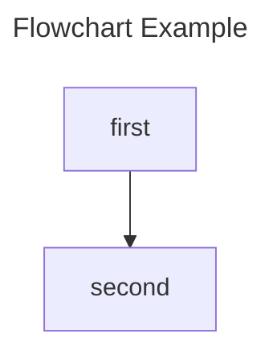
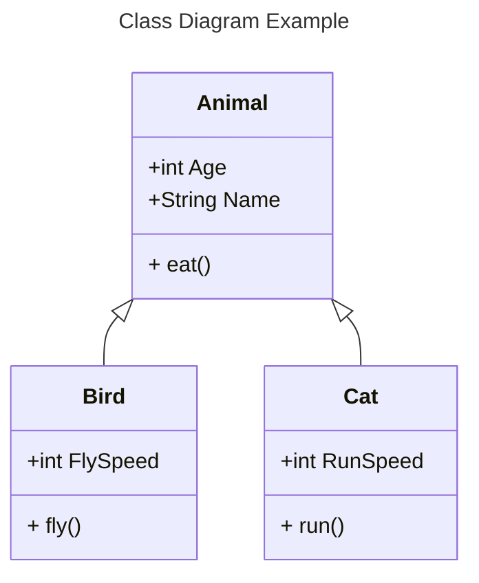

# Mermaid | Diagram as code

```mermaid
---
title: Flowchart Example
---
flowchart TD
A["first"] --> B["second"]

```

&nbsp;

```mermaid
---
title: Class Diagram Example
---
classDiagram
    class Animal{
        +int Age
        +String Name
        + eat()
    }

    class Bird{
        +int FlySpeed
        + fly()
    }
    class Cat{
        +int RunSpeed
        + run()
    }

    Animal <|-- Bird
    Animal <|-- Cat

```
